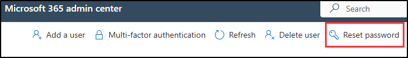

---
lab:
  title: 'Configuración del laboratorio: Preparación del entorno para administración'
  module: Lab setup
---

## Inquilinos de WWL: términos de uso

Si se te proporciona un inquilino porque estás realizando un curso dirigido por un instructor, ten en cuenta que ese inquilino está disponible únicamente como apoyo para los laboratorios prácticos del curso.

Los inquilinos no deben compartirse ni usarse para otros fines que no sean los de los laboratorios prácticos. El inquilino usado en este curso es un inquilino de prueba y no se puede usar ni tener acceso a él después de que la clase haya terminado y no es apto para la extensión.

Los inquilinos no se deben convertir a suscripciones de pago. Los inquilinos obtenidos como parte de este curso siguen siendo propiedad de Microsoft Corporation y nos reservamos el derecho de acceso y recuperación en cualquier momento.

# Configuración del laboratorio: Preparación del entorno para administración

En este laboratorio, configurarás y prepararás el entorno para las tareas de administración. Habilitarás las características necesarias, configurarás los permisos y prepararás los servicios principales para la administración.

**Tareas:**

1. Habilitación de la auditoría en el Portal de Microsoft Purview  
1. Habilitar incorporación de dispositivos  
1. Habilitación del análisis de riesgos internos y uso compartido de datos  
1. Establecimiento de contraseñas de usuario para ejercicios de laboratorio  
1. Inicialización de Microsoft Defender XDR

## Tarea 1: Habilitación de la auditoría en Microsoft Purview portal

En esta tarea, habilitarás la auditoría en el Portal de Microsoft Purview para supervisar las actividades del portal.

1. Inicia sesión en la máquina virtual Client 1 (SC-401-CL1) como la cuenta **SC-401-CL1\admin** y en Microsoft 365 con la cuenta Administrador MOD.

1. En Microsoft Edge, ve al Portal de Microsoft Purview, `https://purview.microsoft.com`, e inicia sesión.

1. Aparecerá un mensaje sobre el nuevo Portal de Microsoft Purview en la pantalla. Selecciona **Comenzar** para acceder al nuevo portal.

    

1. Selecciona **Soluciones** en la barra lateral izquierda y, después, selecciona **Auditar**.

1. En la página **Buscar**, selecciona la barra **Iniciar grabación de usuarios y actividad de administrador** para habilitar el registro de auditoría.

    

1. Una vez que selecciones esta opción, la barra azul debe desaparecer de esta página.

<!----- PowerShell instructions

1. Open an elevated Terminal window by selecting the Windows button with the right mouse button and then select **Terminal (Admin)**.

1. Run the **Install Module** cmdlet in the terminal window to install the latest **Exchange Online PowerShell** module version:

    ```powershell
    Install-Module ExchangeOnlineManagement
    ```

1. Confirm the NuGet provider prompt by typing **Y** for Yes and press **Enter**.

1. Confirm the Untrusted repository security dialog with **Y** for Yes and press **Enter**.  This process may take some time to complete.

1. Run the **Set-ExecutionPolicy** cmdlet to change your execution policy and press **Enter**

    ```powershell
    Set-ExecutionPolicy -ExecutionPolicy RemoteSigned -Scope CurrentUser
    ```

1. Close the PowerShell window.

1. Open a regular (non-elevated) PowerShell window by right-clicking the Windows button and selecting **Terminal**.

1. Run the **Connect-ExchangeOnline** cmdlet to use the Exchange Online PowerShell module and connect to your tenant:

    ```powershell
    Connect-ExchangeOnline
    ```

1. When the **Sign in** window is displayed, sign in as `admin@WWLxZZZZZZ.onmicrosoft.com` (where ZZZZZZ is your unique tenant ID provided by your lab hosting provider). Admin's password should be provided by your lab hosting provider.

1. To check if Audit is enabled, run the **Get-AdminAuditLogConfig** cmdlet:

    ```powershell
    Get-AdminAuditLogConfig | FL UnifiedAuditLogIngestionEnabled
    ```

1. If _UnifiedAuditLogIngestionEnabled_ returns false, then Audit is disabled.

1. To enable the Audit log, run the **Set-AdminAuditLogConfig** cmdlet and set the **UnifiedAuditLogIngestionEnabled** to _true_:

    ```powershell
    Set-AdminAuditLogConfig -UnifiedAuditLogIngestionEnabled $true
    ```

1. To verify that Audit is enabled, run the **Get-AdminAuditLogConfig** cmdlet again:

    ```powershell
    Get-AdminAuditLogConfig | FL UnifiedAuditLogIngestionEnabled
    ```

1. _UnifiedAuditLogIngestionEnabled_ should return _true_ to let you know Audit is enabled.

-->

Has habilitado correctamente la auditoría en Microsoft 365.

## Tarea 2: Habilitación de la incorporación de dispositivos

En esta tarea, habilitarás la incorporación de dispositivos para tu organización.

1. Todavía deberías estar conectado en la máquina virtual Client 1 (SC-401-CL1) como la cuenta **SC-401-CL1\admin** y deberías estar como Administrador de MOD en Microsoft 365.

1. En **Microsoft Edge**, ve a **`https://purview.microsoft.com`** para iniciar sesión en Microsoft Purview y selecciona **Configuración** en la barra lateral izquierda.

1. En la barra lateral izquierda, expande **Incorporación de dispositivos** y selecciona **Dispositivos**.

1. En la página **Dispositivos**, selecciona **Activar la incorporación de dispositivos** y, después, selecciona **Aceptar** para habilitar la incorporación de dispositivos.

1. Cuando se te solicite, selecciona **Aceptar** para confirmar que la supervisión de dispositivos está activada.

Ya has habilitado la incorporación de dispositivos, así que puedes empezar a incorporar dispositivos para protegerte con directivas DLP de punto de conexión. El proceso para habilitar la característica puede tardar hasta 30 minutos.

## Tarea 3: Habilitación del análisis de riesgos internos y uso compartido de datos

En esta tarea, habilitarás el análisis y el uso compartido de datos para la administración de riesgos internos.

1. Todavía deberías estar conectado en la máquina virtual Client 1 (SC-401-CL1) como la cuenta **SC-401-CL1\admin** y estar como Administrador de MOD en Microsoft Purview.

1. En Microsoft Purview, ve a **Configuración** > **Administración de riesgos internos** > ** Análisis.**

1. Cambia esta configuración a **Activado**:

   - **Mostrar información en el nivel de inquilino**

   - **Mostrar información en el nivel de usuario**

1. Seleccione **Guardar** en la parte inferior de la página.

1. En el panel de navegación izquierdo, selecciona **Uso compartido de datos**.

1. En la sección Uso compartido de datos, cambia **Compartir detalles de riesgo de usuario con otras soluciones de seguridad** a **Activado**.

1. Seleccione **Guardar** en la parte inferior de la página.

Has habilitado el análisis y el uso compartido de datos para la administración de riesgos internos.

## Tarea 4: Establecimiento de contraseñas de usuario para ejercicios de laboratorio

En esta tarea, establecerás contraseñas para las cuentas de usuario necesarias para los laboratorios.

1. Todavía deberías estar conectado en la máquina virtual Client 1 (SC-401-CL1) como la cuenta **SC-401-CL1\admin** y deberías estar como Administrador de MOD en Microsoft 365.

1. Abre **Microsoft Edge** y ve a **`https://admin.microsoft.com`** para iniciar sesión en el Centro de administración de Microsoft 365 como Administrador MOD, `admin@WWLxZZZZZZ.onmicrosoft.com` (donde ZZZZZZ es tu identificador de inquilino único proporcionado por el proveedor de hospedaje del laboratorio).

> [!note] **Nota**: En algunos inquilinos, es posible que veas un mensaje de cumplimiento de MFA del portal al iniciar sesión. Si aparece este mensaje:
> - Selecciona **Posponer MFA** para retrasar temporalmente la configuración de MFA.
>
>   
> - Selecciona **Confirmar posposición**.
>
> - Selecciona **Continuar inicio de sesión sin MFA** para acceder al centro de administración.
>
> Esto pospone el cumplimiento de MFA para el inquilino y te permite continuar con el laboratorio.

1. En el panel de navegación izquierdo, expande **Usuarios** y selecciona **Todos los usuarios**.

1. Activa la casilla situada a la izquierda de **Joni Sherman**, **Lynne Robbins** y **Megan Bowen**.

   Estas cuentas se usarán en todos los ejercicios del laboratorio.

   

1. Selecciona el botón **Restablecer contraseña** en el panel de navegación superior para restablecer las tres contraseñas.

   

1. En la página flotante **Restablecer contraseña** de la derecha, asegúrate de que ambas casillas están deseleccionadas.

   Esto garantizará que puedas seleccionar una contraseña para los tres usuarios que se usan para ejercicios y que estas contraseñas no deban restablecerse al iniciar sesión por primera vez.

1. En el campo **Contraseña**, escribe una contraseña que puedas recordar para restablecer las contraseñas de usuario que se usarán en ejercicios futuros.

1. En la parte inferior de la página flotante **Restablecer contraseña**, selecciona el botón **Restablecer contraseña**.

1. En la página **Se han restablecido las contraseñas**, deberías ver las tres cuentas de usuario que se han restablecido. En la parte inferior de esta página flotante, selecciona **Cerrar**.

Has restablecido correctamente las contraseñas de los ejercicios de laboratorio.

## Tarea 5: Inicialización de Microsoft Defender XDR

En esta tarea, abrirás Microsoft Defender y esperarás a que Microsoft Defender XDR termine de inicializarse.

1. Todavía deberías estar conectado en la máquina virtual Client 1 (SC-401-CL1) como la cuenta **SC-401-CL1\admin** y estar como Administrador de MOD en Microsoft Purview.

1. En **Microsoft Edge**, ve a **`https://security.microsoft.com/`** para abrir Microsoft Defender.

1. En el panel de navegación, selecciona **Investigación y respuesta** > **Incidentes y alertas** > ** Incidentes.**

> [!note] **Nota**: La pantalla de inicialización de Microsoft Defender XDR podría aparecer o no en función del inquilino del laboratorio. Si aparece, puedes continuar con otras tareas mientras se completa en segundo plano.

1. Verás un mensaje que indica que se está preparando Microsoft Defender XDR. Este proceso se ejecuta automáticamente y puede tardar unos minutos.

   

Se está inicializando Microsoft Defender XDR. Puedes continuar con otras tareas mientras finaliza la configuración.
