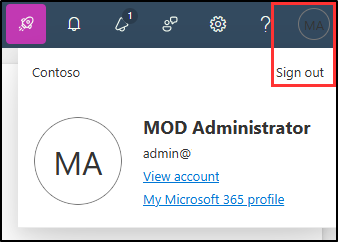

---
lab:
  title: 'Ejercicio 1: Administración de roles de cumplimiento y seguridad'
  module: Module 1 - Implement Information Protection
---
## Inquilinos de WWL: términos de uso

Si se te proporciona un inquilino porque estás realizando un curso dirigido por un instructor, ten en cuenta que ese inquilino está disponible únicamente como apoyo para los laboratorios prácticos del curso.

Los inquilinos no deben compartirse ni usarse para otros fines que no sean los de los laboratorios prácticos. El inquilino usado en este curso es un inquilino de prueba y no se puede usar ni tener acceso a él después de que la clase haya terminado y no es apto para la extensión.

Los inquilinos no se deben convertir a suscripciones de pago. Los inquilinos obtenidos como parte de este curso siguen siendo propiedad de Microsoft Corporation y nos reservamos el derecho de acceso y recuperación en cualquier momento.

# Laboratorio 1. Ejercicio 1: Administración de roles de cumplimiento y seguridad

Como administrador de seguridad de la información contratado recientemente para Contoso Ltd., tú (Joni Sherman) necesitas asegurarte de que el nuevo inquilino de Microsoft 365 cumple con varios estándares legales y normativos. Contoso Ltd. se está expandiendo y tu rol es fundamental para mantener el cumplimiento en las regiones.

**Tareas:**

1. Asignación de roles de cumplimiento y seguridad
1. Explorarás el portal de cumplimiento de Microsoft Purview

## Tarea 1: Asignación de roles de cumplimiento y seguridad

En esta tarea, asignarás el rol de Administrador de cumplimiento a Joni Sherman.

1. Inicia sesión en la VM cliente 1 (SC-401-CL1) como la cuenta **SC-401-CL1\admin**. El proveedor de hospedaje del laboratorio debe proporcionar la contraseña.

1. Abre **Microsoft Edge**, ve al Centro de administración de Microsoft 365, `https://admin.microsoft.com`, e inicia sesión como **Administrador MOD**,`admin@WWLxZZZZZZ.onmicrosoft.com` (donde ZZZZZZ es tu id. de inquilino único proporcionado por el proveedor de hospedaje del laboratorio). La contraseña de administrador te la debería haber proporcionado tu proveedor de servicios de hospedaje de laboratorio.

1. En la barra lateral izquierda, expande **Usuarios**, a continuación, selecciona **Usuarios activos**.

1. En la página **Usuarios activos**, busca `Joni` y selecciona **Joni Sherman**.

1. Las propiedades de la cuenta de Joni se muestran en un panel de control flotante a la derecha. Selecciona **Administrar roles** en el panel de control flotante.

1. En el panel **Administrar roles de administrador**, selecciona **Acceso al Centro de administración** y desplázate hacia abajo para expandir **Mostrar todo por categoría**.

1. En la categoría **Seguridad y cumplimiento**, activa la casilla **Administrador de cumplimiento** y **Administrador de seguridad** y, a continuación, selecciona **Guardar cambios** en la parte inferior del panel del control flotante.

1. Deberías ver un mensaje: **Roles de administrador actualizados**.

1. En la página **Administrar roles de administrador**, selecciona la **X** en la esquina superior derecha del panel de control flotante para cerrar el panel.

1. Cierra la sesión de la cuenta de Administrador MOD seleccionando el icono **MA** en la parte superior derecha y selecciona **Cerrar sesión**.

   

Has asignado correctamente a Joni Sherman los roles de Administrador de cumplimiento y seguridad, que es necesario para completar las tareas de este laboratorio.

## Tarea 2: Exploración del Microsoft Purview Portal

En esta tarea, iniciarás sesión como Joni Sherman para explorar el Microsoft Purview Portal.

1. Todavía debes tener la sesión iniciada en la VM cliente 1 (SC-401-CL1) como la **cuenta SC-401-CL1\admin**.

1. En **Microsoft Edge**, ve a **`https://purview.microsoft.com`**.

1. Cuando se muestre la ventana **Elegir una cuenta**, selecciona **Usar otra cuenta**.

1. Cuando se muestra la ventana **Iniciar sesión**, deberás iniciar sesión como `JoniS@WWLxZZZZZZ.onmicrosoft.com` (donde ZZZZZZZZ es el id. de inquilino único proporcionado por el proveedor de hospedaje de laboratorio) y utilizar la contraseña administrativa para el inquilino. La contraseña de Joni se estableció en un ejercicio anterior.

1. Aparecerá un mensaje sobre el nuevo Portal de Microsoft Purview en la pantalla. Selecciona **Comenzar** para acceder al nuevo portal.

1. Familiarízate con el nuevo Microsoft Purview Portal. Cuando hayas terminado, deja abierta la ventana del explorador.

Has cambiado correctamente a la cuenta de Joni Sherman y ahora estás listo para iniciar el laboratorio.
