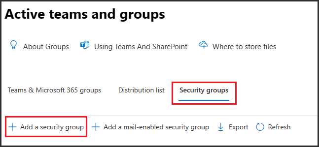

---
lab:
  title: 'Ejercicio 2: Creación y administración de tipos de información confidencial'
  module: Module 1 - Implement Information Protection
---


# Laboratorio 1: Ejercicio 2: Creación y administración de tipos de información confidencial

Joni Sherman, administradora de seguridad de la información de Contoso Ltd., está actualizando la estrategia de protección de información de la organización después de incidentes anteriores que implican el uso compartido accidental de datos personales en incidencias de soporte técnico. Debe crear y probar tipos de información confidencial personalizados que ayuden a detectar identificadores de empleado y referencias a información de salud personal en documentos y correos electrónicos.

**Tareas:**

1. Creación de tipos de información confidencial personalizados
1. Modificación del nivel de confianza para reducir falsos positivos
1. Creación de un grupo de seguridad y asignación de roles para crear un clasificador de EDM
1. Creación de un tipo de información de clasificación basado en EDM
1. Creación de un origen de datos de clasificación basado en EDM
1. Creación de un diccionario de palabras clave
1. Prueba de los tipos de información confidencial personalizados

## Tarea 1: Creación de tipos de información confidencial personalizados

En esta tarea, crearás un nuevo tipo de información confidencial personalizada que reconoce el patrón de identificadores de empleado cerca de las palabras clave "Employee" y "ID".

1. Todavía debes tener la sesión iniciada en la máquina virtual Client 1 (SC-401-CL1) como la cuenta **SC-401-CL1\admin**.

1. En **Microsoft Edge**, ve a **`https://purview.microsoft.com`** e inicia sesión en Microsoft Purview portal como `JoniS@WWLxZZZZZZ.onmicrosoft.com` (donde ZZZZZZ es tu identificador de inquilino único proporcionado por el proveedor de hospedaje del laboratorio). La contraseña de Joni se estableció en un ejercicio anterior.

1. En la barra lateral izquierda, selecciona **Soluciones** y, después, selecciona **Information Protection**.

1. En la barra lateral izquierda, expande **Clasificadores** y, después, selecciona **Tipos de información confidencial**.

1. En la página **Tipos de información confidencial**, selecciona **+ Crear tipo de información confidencial** para iniciar la configuración del tipo de información confidencial.

1. En la página **Nombre de tipo de información confidencial**, escribe:

    - **Nombre**: `Contoso Employee IDs`
    - **Descripción**: `Pattern for Contoso employee IDs.`

1. Selecciona **Siguiente**.

1. En la página **Definir patrones para este tipo de información confidencial**, selecciona **Crear patrón**.

1. En el panel de control flotante **Nuevo patrón**, selecciona **+ Agregar elemento principal** > **Expresión regular**.

1. En el panel de control flotante **+ Agregar una expresión regular** a la derecha, escribe:

   - **Id.**: `Contoso IDs`
   - **Expresión regular**: `[A-Z]{3}[0-9]{6}`
   - Selecciona el botón de selección de _Coincidencia de cadena_.

1. Selecciona **Listo** en la parte inferior del panel de control flotante.

1. De nuevo en el panel de control flotante **Nuevo patrón**, en **Elementos auxiliares**, selecciona el menú desplegable **+ Agregar elementos auxiliares o grupo de elementos** y selecciona **Lista de palabras clave**.

1. En el panel de control flotante **Agregar una lista de palabras clave** a la derecha, escribe:

   - **Id.**: `Employee ID keywords`
   - **No distinguir entre mayúsculas y minúsculas:**

      ```text
      Employee
      ID
      ```

   - Selección del botón de radio para _Coincidencia de palaras_

1. Selecciona **Listo** en la parte inferior del panel de control flotante.

1. De nuevo en el panel de control flotante **Nuevo patrón** en **Proximidad de caracteres**, reduce el valor **Detectar elementos principales Y auxiliares** a `100` caracteres.

1. Selecciona el botón **Crear** en la parte inferior del panel de control flotante.

1. De nuevo en la página **Definir patrones para este tipo de información confidencial**, selecciona **Siguiente**.

1. En la página **Elegir el nivel de confianza recomendado para mostrar en las directivas de cumplimiento**, usa el valor predeterminado y selecciona **Siguiente**.

1. En la página **Revisar configuración y finalizar**, revisa la configuración y selecciona **Crear**. Cuando se haya creado correctamente, selecciona **Listo**.

1. Cierra la sesión de la cuenta de Joni mediante la selección de la imagen de perfil de Joni Sherman en la parte superior derecha. Selecciona **Cerrar sesión** y cierra la ventana del explorador.

Has creado correctamente un nuevo tipo de información confidencial para identificar identificadores de empleado en el patrón de tres caracteres en mayúsculas, seis números y las palabras clave "Employee" o "ID" dentro de un intervalo de 100 caracteres.

## Tarea 2: Modificación del nivel de confianza para reducir falsos positivos

Has recibido informes de que no se detectan algunos documentos que contienen identificadores de empleado. Para mejorar la cobertura de detección, reducirás el nivel de confianza del patrón en los identificadores de empleado de Contoso SIT para que se desencadene incluso cuando solo se encuentre evidencia parcial, lo que aumenta la probabilidad de detección.

1. Todavía debes tener la sesión iniciada en la máquina virtual Client 1 (SC-401-CL1) como la cuenta **SC-401-CL1\admin** y en Microsoft Purview como Joni Sherman.

1. En Microsoft Edge, ve a `https://purview.microsoft.com`.

1. En el panel de navegación izquierdo, selecciona **Soluciones** > **Information Protection** > **Clasificadores** > ** Tipos de información confidencial**.

1. Busca `Contoso Employee IDs` en la lista y selecciona el nombre SIT para abrir la página de detalles.

1. Selecciona el botón **Editar** en la parte superior de la página para modificar el SIT.

1. En la página **Nombre de tipo de información confidencial**, selecciona **Siguiente**.

1. En la página **Definir patrones para este tipo de información confidencial**, expande **Patrón #1** y revisa la configuración.

1. Selecciona el icono de lápiz situado a la derecha para editar el patrón.

1. En el control flotante **Editar patrón**, establece la lista desplegable **Nivel de confianza** en **Confianza media**, lo que permite coincidencias con menos evidencia de apoyo que la confianza alta.

1. Selecciona **Actualizar** en la parte inferior del menú desplegable.

1. Selecciona **Siguiente** hasta llegar a la página **Revisar configuración y finalizar**.

1. Selecciona **Guardar** y, a continuación, selecciona **Listo** para actualizar el tipo de información confidencial.

Has reducido correctamente el nivel de confianza para aumentar la sensibilidad del SIT personalizado, lo que ayuda a garantizar que sea más probable que se marquen los documentos con contenido coincidente parcial.

## Tarea 3: Creación de un grupo de seguridad y asignación de roles para crear un clasificador de EDM

En esta tarea, crearás el grupo de roles para crear un clasificador de EDM y agregarás Joni al nuevo grupo de roles.

1. Todavía debes tener la sesión iniciada en la máquina virtual Client 1 (SC-401-CL1) como la cuenta **SC-401-CL1\admin**.

1. Abre **Microsoft Edge** y ve a **`https://admin.microsoft.com`**.

1. Cuando se muestre la página **Seleccionar una cuenta**, selecciona **Usar otra cuenta** e inicia sesión como **Administrador de MOD**`admin@WWLxZZZZZZ.onmicrosoft.com` (donde ZZZZZZZZ es el id. de inquilino único proporcionado por el proveedor de hospedaje del laboratorio). La contraseña de administrador te la debería haber proporcionado tu proveedor de servicios de hospedaje de laboratorio.

1. En el panel izquierdo, expande **Equipos y grupos** y selecciona **Equipos y grupos activos**.

1. En la parte superior de la página **Grupos y equipos activos**, selecciona **Grupos de seguridad** y, a continuación, selecciona **+ Agregar un grupo de seguridad**.

    

1. En la pantalla **Configurar los datos básicos**, especifica:

    - **Nombre**: `EDM_DataUploaders`
    - **Descripción**: `People who upload data for EDM.`

1. Seleccione **Siguiente**.

1. En la página **Editar configuración**, deja la configuración predeterminada y selecciona **Siguiente**.

1. En la página **Revisar y finalizar agregar grupo**, revisa la configuración y selecciona **Crear grupo**.

1. En la página **Grupo creado EDM_DataUploaders**, selecciona **Cerrar**.

1. De nuevo, en la página **Equipos y grupos activos**, asegúrate de que la pestaña **Seguridad** está seleccionada en la cinta de navegación superior y selecciona el botón **Actualizar** para mostrar el grupo de seguridad recién creado. Selecciona el grupo **EDM_DataUploaders** en la lista para abrir el panel flotante **EDM_DataUploaders** a la derecha.

1. Selecciona la pestaña **Miembros** y selecciona **Ver y administrar todos los miembros**.

1. En la página **Miembros**, selecciona **+ Agregar miembros**.

1. En la página **Agregar miembros**, activa la casilla situada a la izquierda de **Joni Sherman** y selecciona el botón **Agregar (1)** situado en la parte inferior del panel flotante.

1. Comprueba que **Joni Sherman** aparece debajo de **Miembros** y cierra el panel flotante seleccionando la **X** en la parte superior derecha del panel flotante.

1. Selecciona el icono de Ma en la parte superior derecha de la ventana para cerrar la sesión de la cuenta de Administrador de MOD y, después, selecciona **Cerrar sesión** y cierra la ventana del explorador.

Has creado el **grupo de EDM_DataUploaders** y has asignado correctamente el acceso a Joni para crear un clasificador de EDM.

## Tarea 4: Creación de un tipo de información de clasificación basado en EDM

En esta tarea, crearás una clasificación basada en coincidencias exactas de datos (EDM) con un esquema de base de datos de los datos de los empleados.

1. Abre **Microsoft Edge** y ve a Microsoft Purview Portal en `https://purview.microsoft.com`.

1. Cuando se muestre la página **Seleccionar una cuenta**, selecciona **Joni Sherman** e inicia sesión.

1. Ve a **Information Protection** seleccionando **Soluciones** > **Information Protection** en la barra lateral izquierda.

1. En la página **Information Protection**, expande **Clasificadores** y selecciona **Clasificadores de EDM**.

1. En la página **Clasificadores de EDM**, selecciona **+ Crear clasificador de EDM**.

1. Revisa **Familiarizarte con los pasos necesarios para poner a trabajar el clasificador** para comprender el flujo de trabajo para crear clasificadores de EDM y, después, selecciona **Crear clasificador de EDM**.

1. En la página **Nombre y descripción del clasificador de EDM** específica:

    - **Nombre**: `employeedb`
    - **Descripción**: `Employee Database schema`

1. Seleccione **Siguiente**.

1. En la página **Elegir un método para definir el esquema**, selecciona **Definir manualmente la estructura de datos** y, después, selecciona **Siguiente**.

1. En **Definir columnas que contienen los datos que deseas detectar**, específica estas columnas:

   - `Name`
   - `BirthDate`
   - `StreetAddress`
   - `EmployeeID`

   Selecciona **+ Agregar columna** para agregar los campos restantes hasta que tengas cuatro columnas totales.

      

1. Seleccione **Siguiente**.

1. En la página **Seleccionar elementos principales**, busca la columna **EmployeeID**. Expande la lista desplegable **Modo de coincidencia** donde se muestra **Token único**. Selecciona el **+** (signo más) para **Elegir un SIT**.

      

1. En el panel flotante **Elegir un tipo de información confidencial para "EmployeeID"** a la derecha, en la barra de búsqueda, busca `Contoso`.

1. Se debe mostrar el tipo de información confidencial **Id. de empleado de Contoso** creado en una tarea anterior. Activa la casilla situada a la izquierda de este tipo de información confidencial y, a continuación, selecciona **Guardar**.

1. De nuevo en la página **Seleccionar elementos principales**, activa la casilla situada a la derecha de **EmployeeID** para identificar este campo como **Elemento principal**.

      

1. Seleccione **Siguiente**.

1. En la **Configuración de los datos de las columnas seleccionadas**, asegúrate de que el botón de alternancia esté establecido en **Sí** para **Usar la misma configuración para todas las columnas**.

1. Activa la casilla **Irgnorar delimitadores y puntuación para los datos de todas las columnas**.

1. Selecciona la lista desplegable para **Elegir delimitadores y puntuación para ignorar** y selecciona:

   - _Guion ('-')_
   - _Punto ('.')_
   - _Espacio (' ')_
   - _Paréntesis de apertura ('(')_
   - _Paréntesis de cierre (')')_

1. Haz clic en cualquier lugar fuera de la lista desplegable y, a continuación, selecciona **Siguiente**.

1. En **Configurar reglas de detección para los elementos principales**, deja la configuración predeterminada y, a continuación, selecciona **Siguiente**.

1. En la **página Revisar configuración y finalizar**, seleccione **Enviar**.

1. En la página **Ha creado correctamente un clasificador de EDM**, asegúrate de capturar el **Nombre de esquema** que se va a usar en la tarea siguiente.

      

1. Una vez que haya capturado el nombre del esquema, seleccione **Listo**.

1. Deja el explorador abierto con Microsoft Purview portal.

Has creado correctamente un nuevo tipo de información confidencial de clasificación basada en EDM para identificar los datos de los empleados de un origen de archivo de base de datos.

## Tarea 5: Creación de un origen de datos de clasificación basado en EDM

En esta tarea, vas a aplicar un hash y cargar los datos reales para el tipo de información confidencial de clasificación basada en EDM a través de la herramienta de agente de carga de EDM.

1. Todavía debes tener la sesión iniciada en la máquina virtual Client 1 (SC-401-CL1) como la cuenta **SC-401-CL1\admin** y en Microsoft 365 como **Joni Sherman**.

1. En **Microsoft Edge**, ve a **`https://go.microsoft.com/fwlink/?linkid=2088639`** para descargar el agente de carga de EDM.

1. Una vez completada la descarga, selecciona **Abrir archivo** en la ventana del explorador Microsoft Edge para abrir el asistente para la **Instalación del agente de carga de coincidencias exactas de datos de Microsoft**.

1. En la página **Bienvenido al Asistente para la instalación del agente de carga de coincidencias exactas de datos de Microsoft**, selecciona **Siguiente**.

1. En la página **Contrato de licencia para el usuario final**, activa la casilla **Acepto los términos del Contrato de licencia** y selecciona **Siguiente**.

1. En la página **Carpeta de destino**, no cambies la ruta de acceso de destino predeterminada y selecciona **Siguiente**.

1. En la página **Listo para instalar el Agente de carga de coincidencias exactas de datos de Microsoft**, selecciona **Instalar**.

1. Si se muestra la ventana **Control de cuentas de usuario**, selecciona **Sí** para permitir que esta aplicación realice cambios en el dispositivo.

1. Cuando finalice la instalación, selecciona **Finalizar** en la página **Finalización del Asistente para la instalación del Agente de carga de coincidencias exactas de datos de Microsoft**.

1. En la barra de tareas, busca `Notepad` en el campo de búsqueda. Selecciona la aplicación **Bloc de notas** en la sección **Mejor coincidencia** de la búsqueda.

1. En el Bloc de notas, escribe:

    ``` text
    Name,Birthdate,StreetAddress,EmployeeID
    Joni Sherman,01.06.1980,1 Main Street,CSO123456
    Lynne Robbins,31.01.1985,2 Secondary Street,CSO654321
    ```

1. En el Bloc de notas, selecciona **Archivo** y **Guardar como** para guardar el archivo.

1. Selecciona **Documentos** en el panel izquierdo y escribe `EmployeeData.csv` como **Nombre de archivo** y, a continuación, selecciona **Guardar**.

1. Cierra la ventana Bloc de notas.

1. Haz clic con el botón derecho en el símbolo de Windows en la barra de tareas y selecciona **Terminal (Administrador)**.

1. Si se muestra la ventana **Control de cuentas de usuario**, selecciona **Sí** para permitir que esta aplicación realice cambios en el dispositivo.

1. En la ventana del terminal, ve al directorio del agente de carga de EDM:

    ``` powershell
    cd "C:\Program Files\Microsoft\EdmUploadAgent"
    ```

1. Autoriza con tu cuenta cargar la base de datos en el inquilino mediante la ejecución de este cmdlet:

    ``` powershell
    .\EdmUploadAgent.exe /Authorize
    ```

1. Cuando se muestre la ventana **Seleccionar una cuenta**, inicia sesión como `JoniS@WWLxZZZZZZ.onmicrosoft.com`, (donde ZZZZZZ es el identificador de inquilino único proporcionado por el proveedor de hospedaje del laboratorio). La contraseña de Joni se estableció en un ejercicio anterior.

1. De nuevo en la ventana del terminal, descarga la definición del esquema de la base de datos del tipo de información confidencial de clasificación basada en EDM mediante la ejecución de este script en PowerShell. Para **DataStoreName**, aquí es donde usarás el nombre de esquema guardado de la tarea anterior.

    ``` powershell
    .\EdmUploadAgent.exe /SaveSchema /DataStoreName employeedbSchema /OutputDir "C:\Users\Admin\Documents\"
    ```

    Deberías recibir un mensaje informándote de que los comandos se completaron correctamente.

    > [!Note] **Nota**: si se produce un error en el último comando, es posible que tardes más tiempo hasta que se aplique la pertenencia al grupo **EDM_DataUploaders**. Puede tardar hasta una hora hasta que sea posible descargar el archivo de esquema.  Si se produce un error, continúa con la siguiente tarea y vuelve a este paso más adelante.

1. Para aplicar un hash al archivo de base de datos y cargarlo en el tipo de información confidencial de clasificación basada en EDM, ejecuta el siguiente script en PowerShell:

    ``` powershell
    .\EdmUploadAgent.exe /UploadData /DataStoreName employeedbSchema /DataFile "C:\Users\Admin\Documents\EmployeeData.csv" /HashLocation "C:\Users\Admin\Documents\" /Schema "C:\Users\Admin\Documents\employeedbSchema.xml"
    ```

    Deberías recibir un mensaje informándote de que los comandos se completaron correctamente.

1. Comprueba el progreso de la carga con este comando:

    ``` powershell
    .\EdmUploadAgent.exe /GetSession /DataStoreName employeedbSchema
    ```

1. En la ventana de terminal, una vez que el estado sea **Completado**, los datos de EDM están listos para su uso.

    Como alternativa, también puedes actualizar la ventana **Clasificadores de EDM** en Microsoft Purview portal para comprobar el estado del hash. Una vez establecido el estado en **Índice completado**, el hash se ha completado.

    > [!Note] **Nota**: este proceso puede tardar cierto tiempo. Es posible que tengas que ejecutar el script GetSession o actualizar la página clasificadores de EDM varias veces antes de que el estado indique que el hash se ha completado.

    

    

1. Cierre la ventana de terminal.

Has aplicado hash y has cargado un archivo de base de datos correctamente para un tipo de información confidencial de clasificación basada en EDM.

## Tarea 6: Creación de un diccionario de palabras clave

Se produjeron varias infracciones de pérdida de información personal cuando los usuarios enviaron correos electrónicos después de que los compañeros informaran de una baja por enfermedad. En esos casos, se reveló la razón de la enfermedad. No queremos que eso suceda. En esta tarea, crearás un diccionario de palabras clave para evitar la pérdida de información personal en los correos electrónicos.

1. Todavía debes tener la sesión iniciada en la máquina virtual Client 1 (SC-401-CL1) como la cuenta **SC-401-CL1\admin** y en Microsoft 365 como **Joni Sherman**.

1. El Microsoft Purview portal todavía debe estar en la página de clasificadores de EDM en Microsoft Edge. Si no, en Microsoft Edge, ve a `https://purview.microsoft.com` > **Soluciones** > **Information Protection**.

1. En la barra lateral izquierda, expande **Clasificadores** y, después, selecciona **Tipos de información confidencial**.

1. Selecciona **+ Crear tipo de información confidencial** para abrir la configuración de un nuevo tipo de información confidencial.

1. En la página **Nombre de tipo de información confidencial**, escribe:

    - **Nombre**: `Contoso Diseases List`
    - **Descripción**: `List of possible diseases of employees.`

1. Seleccione **Siguiente**.

1. En la página **Definir patrones para este tipo de información confidencial**, seleccione **Crear patrón**.

1. En el panel flotante **Nuevo patrón** de la derecha, en **Elemento principal**, selecciona **+ Agregar elemento principal** y, a continuación, selecciona **Diccionario de palabras clave**.

1. En la página **Agregar un diccionario de palabras clave**, escribe:

   - **Nombre**: `Diseases Dictionary`
   - **Palabras clave:**

    ```text
    flu
    influenza
    cold
    bronchitis
    otitis
    ```

1. Selecciona **Listo** en la parte inferior del panel de control flotante.

1. De nuevo en la página **Nuevo patrón**, en **Elementos auxiliares**, selecciona **+ Agregar elementos auxiliares o grupo de elementos** y luego selecciona **Lista de palabras clave** para agregar soporte adicional para el diccionario de palabras clave.

1. En la página **Agregar una lista de palabras clave**, escribe:

   - **Id.**: `Employee absence`
   - **No distinguir entre mayúsculas y minúsculas:**

    ``` text
    employee
    absence
    reason
    ```

1. Selecciona **Listo** en la parte inferior del panel de control flotante.

1. De nuevo en la página **Nuevo patrón**, revisa la configuración y selecciona **Crear**.

1. De nuevo en **Definir patrones para este tipo de información confidencial**, selecciona **Siguiente**.

1. En **Elegir el nivel de confianza recomendado para mostrar en las directivas de cumplimiento**, deja el valor predeterminado y, a continuación, selecciona **Siguiente**.

1. En la página **Revisar configuración y finalizar**, revisa la configuración y selecciona **Crear**. Una vez creado el tipo de información confidencial, selecciona **Listo** en la página **Se ha creado su tipo de información confidencial**.

1. Deja abierta la ventana del explorador en Microsoft Purview Portal.

Has creado correctamente un nuevo tipo de información confidencial basado en un diccionario de palabras clave y has agregado más palabras clave para reducir la tasa de falsos positivos.

## Tarea 7: Creación de tipos de información confidencial personalizados

Prueba siempre los tipos de información confidencial personalizados antes de usarlos en directivas. De lo contrario, se puede producir una pérdida o filtración de datos si el patrón no está configurado correctamente.

1. Todavía debes tener la sesión iniciada en la máquina virtual Client 1 (SC-401-CL1) como la cuenta **SC-401-CL1\admin** y en Microsoft 365 como **Joni Sherman**.

1. En la barra de tareas, busca `Notepad` en el campo de búsqueda. Selecciona la aplicación **Bloc de notas** en la sección **Mejor coincidencia** de la búsqueda.

1. En el Bloc de notas, escribe:

    ``` text
    Employee Joni Sherman EMP123456 is absent because of the flu/influenza.
    ```

1. Seleccione **Archivo** > **Guardar como**.

1. Selecciona **Documentos** en el panel izquierdo y escribe `SickTestData.txt` como **Nombre de archivo** y selecciona **Guardar**.

1. Cierra la ventana Bloc de notas.

1. De nuevo, en **Microsoft Edge**, Microsoft Purview Portal debe estar abierto en la página **Tipos de información confidencial**.

1. En la barra de **búsqueda** de la esquina superior derecha, escribe `Contoso` y presiona Entrar.

1. Selecciona **Contoso Employee IDs**.

1. Seleccione **Prueba**.

1. En el panel flotante **Cargar archivo para probar Contoso Employee IDs"** a la derecha, selecciona **Cargar archivo**.

1. Selecciona **Documentos** en el panel izquierdo, selecciona el archivo _SickTestData.txt_ y, después, selecciona **Abrir**.

1. Selecciona **Probar** para comenzar el análisis.

1. En la página **Resultados de coincidencias**, revisa las coincidencias y, después, selecciona **Finalizar** para finalizar la prueba.

1. Vuelve a **Tipos de información confidencial** y busca `Contoso` de nuevo.

1. Esta vez selecciona el tipo de información confidencial **Contoso Diseases List** y, después, selecciona **Probar**.

1. En el panel flotante **Cargar archivo para probar "Contoso Diseases List"** a la derecha, selecciona **Cargar archivo**.

1. En el panel **Cargar archivo para probar**, selecciona **Cargar archivo**.

1. Selecciona **Documentos** en el panel izquierdo, selecciona el archivo _SickTestData.txt_ y, después, selecciona **Abrir**.

1. Selecciona **Probar** para comenzar el análisis.

1. En la página **Resultados de coincidencias**, revisa las coincidencias y, después, selecciona **Finalizar** para finalizar la prueba.

Has probado correctamente los dos tipos de información confidencial personalizados y has validado que los patrones de búsqueda funcionan según lo previsto.
