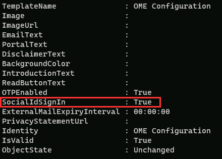
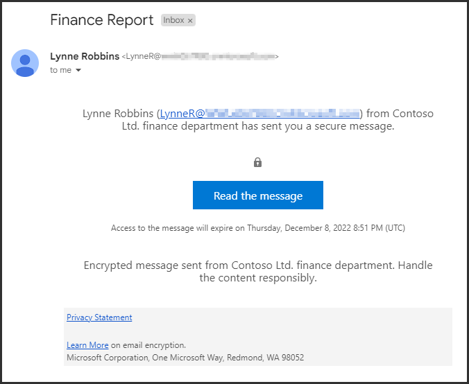

---
lab:
  title: 'Ejercicio 4: Implementación de Cifrado de mensajes de Microsoft Purview'
  module: Module 1 - Implement Information Protection
---

# Laboratorio 1: Ejercicio 4: Implementación de Cifrado de mensajes de Microsoft Purview

Joni Sherman, administrador de seguridad de la información para Contoso Ltd., se ha encargado de garantizar una comunicación segura entre departamentos. Para admitir esto, está configurando Cifrado de mensajes de Microsoft Purview para Contoso, incluyendo la modificación de la configuración predeterminada y la creación de una experiencia de personalización de marca personalizada para el departamento financiero.

**Tareas:**

1. Comprobación de la funcionalidad de Azure RMS
1. Modificación de la plantilla de personalización de marca predeterminada
1. Validación del comportamiento de personalización de marca predeterminado
1. Creación de una plantilla de personalización de marca personalizada
1. Validación del comportamiento de personalización de marca personalizada

## Tarea 1: Comprobación de la funcionalidad de Azure RMS

En esta tarea, comprobarás la funcionalidad correcta de Azure RMS del inquilino.

1. Todavía debes tener la sesión iniciada en la máquina virtual Client 1 (SC-401-CL1) como la cuenta **SC-401-CL1\admin**.

1. Abre PowerShell al hacer clic con el botón derecho en el botón Inicio de la barra de tareas y al seleccionar **Terminal**.

1. Ejecuta el cmdlet **Install Module** en la ventana de terminal para instalar la versión más reciente del módulo **PowerShell de Exchange Online**:

    ```powershell
    Install-Module ExchangeOnlineManagement
    ```

1. Confirma el cuadro de diálogo de seguridad de repositorio no de confianza con **Y** para Sí y presiona **Entrar**.  Este proceso puede tardar un tiempo en finalizar.

1. Ejecuta el cmdlet **Connect-ExchangeOnline** para usar el módulo PowerShell de Exchange Online y conéctate al inquilino:

    ```powershell
    Connect-ExchangeOnline
    ```

1. Cuando se muestra la ventana **Iniciar sesión**, deberás iniciar sesión como `JoniS@WWLxZZZZZZ.onmicrosoft.com` (donde ZZZZZZZZ es el id. de inquilino único proporcionado por el proveedor de hospedaje de laboratorio) y utilizar la contraseña administrativa para el inquilino. Usarás la contraseña con la que has restablecido la de Joni en un laboratorio anterior.

1. Ejecuta el cmdlet **Get-IRMConfiguration** para verificar que Azure RMS e IRM están activados en tu inquilino:

    ```powershell
    Get-IRMConfiguration | fl AzureRMSLicensingEnabled
    ```

   El resultado de **AzureRMSLicensingEnabled** debe ser **True**.

1. Ejecuta el cmdlet **Test-IRMConfiguration** para probar la funcionalidad de Azure RMS mediante el cifrado de mensajes de Office 365 con **Megan Bowen** como remitente y destinatario:

    ```powershell
    Test-IRMConfiguration -Sender MeganB@contoso.com -Recipient MeganB@contoso.com
    ```

    

    Comprueba que todas las pruebas tengan el estado de superado y no se muestran errores.

1. Deja abierta la ventana de PowerShell.

Has instalado correctamente el módulo de PowerShell de Exchange Online, te has conectado a tu inquilino y has comprobado la correcta funcionalidad de Azure RMS.

## Tarea 2: Modificación de la plantilla de personalización de marca predeterminada

Hay un requisito en tu organización para restringir la confianza para los proveedores de identidad extranjeros, como Google o Facebook. Dado que estos identificadores sociales se activan de forma predeterminada para acceder a los mensajes protegidos con cifrado de mensajes, debes desactivar el uso de identificadores sociales para todos los usuarios de tu organización.

1. Deberías seguir conectado a tu VM Cliente 1 (SC-401-CL1) como la cuenta **SC-401-CL1\admin** y debería seguir habiendo una ventana de PowerShell abierta con Exchange Online conectado.

1. Ejecuta el cmdlet **Get-OMEConfiguration** para ver la configuración predeterminada:

    ```powershell
    Get-OMEConfiguration -Identity "OME Configuration" | fl
    ```

   Revisa la configuración y confirma que la propiedad SocialIdSignIn está establecida en **True**.

    

1. Ejecuta **Set-OMEConfiguration** cmdlet para restringir el uso de identificadores sociales para acceder a los mensajes del inquilino protegido con OME:

    ```powershell
    Set-OMEConfiguration -Identity "OME Configuration" -SocialIdSignIn:$false
    ```

1. Confirma el mensaje de advertencia para personalizar la plantilla predeterminada, escribe **Y** para Sí y presiona **Entrar**.

1. Ejecuta **Get-OMEConfiguration** cmdlet para comprobar de nuevo la configuración predeterminada y validar:

    ```powershell
    Get-OMEConfiguration -Identity "OME Configuration" | fl
    ```

    

   Observa que el resultado debe mostrar que SocialIdSignIn está establecido en **False**. Deja abierta la ventana de PowerShell y el cliente.

Has deshabilitado correctamente los proveedores de identidades sociales, lo que ayuda a garantizar que los correos electrónicos cifrados de Contoso solo se pueden abrir mediante cuentas de Microsoft o códigos de acceso de un solo uso, lo que mejora el control sobre el acceso a los mensajes confidenciales.

## Tarea 3: Validación del comportamiento predeterminado de la personalización de marca

Debes confirmar que no se muestra ningún cuadro de diálogo de identificadores sociales para los destinatarios externos al recibir un mensaje protegido con el cifrado de mensajes de Office 365 de los usuarios del inquilino y necesitan usar el OTP en cualquier momento al acceder al contenido cifrado.

> [!alert] La entrega de correo electrónico externo podría bloquearse en algunos entornos de laboratorio. Es posible que esta tarea no se complete según lo previsto.

1. Aún deberías tener la sesión iniciada en la VM Cliente 1 (SC-401-CL1) como **SC-401-CL1\admin**.

1. Abre **Microsoft Edge** en una ventana InPrivate haciendo clic con el botón derecho en Microsoft Edge en la barra de tareas y seleccionando **Nueva ventana InPrivate**.

1. Ve a **`https://outlook.office.com`** e inicia sesión en Outlook en la Web como `LynneR@WWLxZZZZZZ.onmicrosoft.com` (donde ZZZZZZ es el identificador de inquilino único proporcionado por el proveedor de hospedaje del laboratorio). La contraseña de Lynne se estableció en un ejercicio anterior.

1. En el cuadro de diálogo **¿Mantener la sesión iniciada?**, activa la casilla **No volver a mostrar esto** y, a continuación, selecciona **No**.

1. En Outlook en la Web, selecciona **Nuevo correo**.

1. En la línea **Para**, escribe tu dirección de correo electrónico personal u otra de terceros que no esté en el dominio del inquilino. Introduce **`Secret Message`** en el asunto y **`My super-secret message.`** en el cuerpo del correo electrónico.

1. En el panel superior, selecciona **Opciones** y, a continuación, **Cifrar** para cifrar el mensaje. Una vez que hayas cifrado correctamente el mensaje, deberías ver un aviso que indica "Cifrado: Este mensaje está cifrado. Los destinatarios no pueden quitar el cifrado".

      

1. Seleccione **Enviar** para enviar el mensaje. Deja abierta la ventana de Outlook.

1. Inicia sesión en tu cuenta de correo electrónico personal en una nueva ventana y abre el mensaje de Lynne Robbins. Si has enviado este correo electrónico a una cuenta de Microsoft (como @outlook.com) el cifrado podría procesarse automáticamente y verás el mensaje automáticamente. Si has enviado el correo electrónico a otro servicio de correo electrónico como (@gmail.com), es posible que tengas que realizar los siguientes pasos para procesar el cifrado y leer el mensaje.

    > [!Note] **Nota**: Es posible que tengas que comprobar la carpeta de correo no deseado o spam para el mensaje de Lynne Robbins.

1. Selecciona **Leer el mensaje**.

1. Dado que los id. sociales están deshabilitados, no deberías ver una opción para iniciar sesión con una cuenta de terceros.

1. Selecciona **Iniciar sesión con un código de acceso de un solo uso** para recibir un código de acceso de tiempo limitado.

1. Ve al portal de correo electrónico personal y abre el mensaje con el asunto **Código de acceso de un solo uso para ver el mensaje**.

1. Copia el código de acceso, pégalo en el portal de OME y selecciona **Continuar**.

1. Revisa el mensaje cifrado.

Has probado correctamente la plantilla de OME predeterminada modificada con id. sociales desactivados.

## Tarea 4: Creación de plantilla de marca personalizada

Los mensajes protegidos enviados por el departamento financiero de la organización requieren personalización de marca, incluidos textos de introducción y cuerpo personalizados y un vínculo de declinación de responsabilidades en el pie de página. Los mensajes financieros también expirarán después de siete días. En esta tarea, crearás una nueva configuración de OME personalizada y crearás una regla de transporte para aplicar la configuración de OME a todos los correos enviados desde el departamento financiero.

1. Todavía deberías tener la sesión iniciada en la VM Cliente 1 (SC-401-CL1) como **SC-401-CL1\admin** y todavía deberías tener una ventana abierta de PowerShell con Exchange Online conectado.

1. Ejecuta **New-OMEConfiguration** cmdlet para crear una nueva configuración:

    ```powershell
    New-OMEConfiguration -Identity "Finance Department" -ExternalMailExpiryInDays 7
    ```

1. Confirma el mensaje de advertencia para personalizar la plantilla con **Y** para Sí y presiona **Entrar**.

1. Ejecuta **Set-OMEConfiguration** cmdlet con el parámetro _IntroductionText_ para cambiar el texto de introducción:

    ```powershell
    Set-OMEConfiguration -Identity "Finance Department" -IntroductionText " from Contoso Ltd. finance department has sent you a secure message."
    ```

1. Confirma el mensaje de advertencia para personalizar la plantilla con **Y** para Sí y presiona **Entrar**.

1. Ejecuta **Set-OMEConfiguration** cmdlet con el parámetro _EmailText_ para actualizar el texto del cuerpo del correo electrónico cifrado:

    ```powershell
    Set-OMEConfiguration -Identity "Finance Department" -EmailText "Encrypted message sent from Contoso Ltd. finance department. Handle the content responsibly."
    ```

1. Confirma el mensaje de advertencia para personalizar la plantilla con **Y** para Sí y presiona **Entrar**.

1. Ejecuta **Set-OMEConfiguration** cmdlet con el parámetro _PrivacyStatementURL_ para cambiar la dirección URL de la declinación de responsabilidades para que apunte al sitio de declaración de privacidad de Contoso:

    ```powershell
    Set-OMEConfiguration -Identity "Finance Department" -PrivacyStatementURL "https://contoso.com/privacystatement.html"
    ```

1. Confirma el mensaje de advertencia para personalizar la plantilla con **Y** para Sí y presiona **Entrar**.

1. Ejecuta **New-TransportRule** cmdlet para crear una regla de flujo de correo, que aplica la plantilla de OME personalizada a todos los mensajes enviados desde el equipo financiero. Este proceso puede tardar unos segundos en completarse.

    ```powershell
    New-TransportRule -Name "Encrypt all mails from Finance team" -FromScope InOrganization -FromMemberOf "Finance Team" -ApplyRightsProtectionCustomizationTemplate "Finance Department" -ApplyRightsProtectionTemplate Encrypt
    ```

1. Ejecuta **Get-OMEConfiguration** cmdlet para comprobar los cambios.

    ```powershell
    Get-OMEConfiguration -Identity "Finance Department" | Format-List
    ```

1. Cierra la ventana de PowerShell después de revisar los resultados.

Has configurado una regla de transporte que garantiza que los correos electrónicos del departamento financiero estén cifrados y se marcan de forma coherente, lo que refuerza los estándares de seguridad y mensajería de Contoso.

## Tarea 5: Validación del comportamiento de la personalización de marca

Para validar la nueva configuración personalizada, debes volver a usar la cuenta de Lynne Robbins, que es miembro del equipo financiero.

> [!alert] Las restricciones de correo electrónico externo pueden impedir que se reciba este mensaje. Es posible que la personalización de marca no aparezca según lo previsto.

1. Vuelve a **Microsoft Edge** con la ventana Outlook en la Web InPrivate donde todavía deberías tener la sesión iniciada como **Lynne Robbins**.

1. En Outlook en la Web, selecciona **Nuevo correo** en la parte superior izquierda de la pantalla.

1. En la línea **Para**, escribe tu dirección de correo electrónico personal u otra de terceros que no esté en el dominio del inquilino. Escribe **`Finance Report`** en la línea de asunto y escribe **`Secret finance information.`** en el cuerpo del correo electrónico.

1. Selecciona **Enviar** para enviar el mensaje y cierra la ventana InPrivate donde has iniciado sesión como Lynne.

1. Inicia sesión en tu cuenta de correo electrónico personal y abre el mensaje de Lynne Robbins.

1. Deberías ver un mensaje de Lynne Robbins que se parece a la siguiente imagen.  Selecciona **Leer el mensaje**.

    

1. En la configuración personalizada, ambas opciones de autenticación están disponibles, lo que indica que el inicio de sesión con id. social está habilitado. Selecciona **Iniciar sesión con un código de acceso de un solo uso** para recibir un código de acceso de tiempo limitado.

1. Ve al portal de correo electrónico personal y abre el mensaje con el asunto **Código de acceso de un solo uso para ver el mensaje**.

1. Copia el código de acceso, pégalo en el portal y selecciona **Continuar**.

1. Revisa el mensaje cifrado con personalización de marca. Cierra la ventana con tu cuenta de correo electrónico abierta.

Has probado correctamente la nueva plantilla personalizada.
