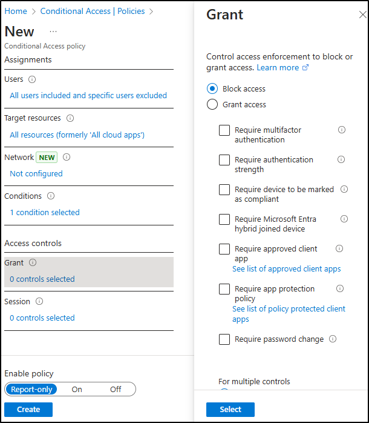

---
lab:
  title: 'Ejercicio 2: Implementación de la protección adaptativa'
  module: Module 3 - Implement Insider Risk Management
---

# Laboratorio 3. Ejercicio 2: Implementación de la protección adaptativa

Eres Joni Sherman, administrador de seguridad de la información para Contoso Ltd. Tu rol implica proteger los datos confidenciales y responder a los riesgos internos. Para mejorar la protección, habilitarás la protección adaptativa de Microsoft Purview, que ajusta dinámicamente la aplicación de prevención de pérdida de datos (DLP) en función de los niveles de riesgo internos.

**Tareas:**

1. Asignación de una directiva de riesgo interno a la protección adaptativa
1. Configuración de las opciones de protección adaptativa para la directiva DLP
1. Configuración del acceso condicional con protección adaptativa
1. Habilitación de la protección adaptativa

## Tarea 1: Asignación de una directiva de riesgo interno a la protección adaptativa

1. Inicia sesión en la máquina virtual Client 1 (SC-401-CL1) como la cuenta **SC-401-cl1\admin**.

1. En **Microsoft Edge**, ve a **`https://purview.microsoft.com`** e inicia sesión como **Joni Sherman**`JoniS@WWLxZZZZZZ.onmicrosoft.com` (donde ZZZZZZ es tu id. de inquilino único proporcionado por el proveedor de hospedaje del laboratorio).

1. En el Microsoft Purview Portal, ve a **Soluciones** > **Administración de riesgos internos** > **Protección adaptativa**.

1. En el panel de navegación izquierdo, selecciona **Niveles de riesgos internos**.

1. En la página **Niveles de riesgos internos**:

   - En la lista desplegable Directiva de riesgos internos, selecciona la **Directiva rápida de filtración de datos** que creaste en un ejercicio anterior.
   - Deja toda la configuración de nivel de riesgo predeterminada sin cambios.
   - Seleccione **Guardar**.

Has vinculado una directiva de riesgo interno a protección adaptativa, lo que permite acciones dinámicas basadas en riesgos en Microsoft Purview.

## Tarea 2: Configuración de las opciones de protección adaptativa para la directiva DLP

Ahora que la protección adaptativa está vinculada a la directiva de riesgos internos, actualizarás una directiva DLP para responder a niveles de riesgos elevados bloqueando el uso compartido de datos confidenciales.

1. En Microsoft Purview, ve a **Soluciones** > ** Prevención de pérdida de datos** > **Directivas**.

1. En la página **Directivas**, activa la casilla de la directiva **Directiva DLP de protección de tarjetas de crédito** creada en un ejercicio anterior y luego selecciona **Editar directiva**.

1. En la configuración DLP, selecciona **Siguiente** hasta que llegues a la página **Personalizar reglas de DLP avanzadas**.

1. Selecciona el icono de lápiz situado junto a la **regla de Información de tarjeta de crédito** para editarla.

1. En la página **Editar regla**:
   - En el campo **Descripción** escribe: `Block sharing of credit card data when user has an elevated insider risk level.`
   - En la sección **Condiciones**, selecciona **Agregar condición** > **Nivel de riesgos internos para la Protección adaptativa.**.
   - En la nueva sección, selecciona **Riesgo elevado**.
   - En **Acciones**, establece **Restringir el acceso o cifrar el contenido en Microsoft 365** a **Bloquear a todos**.
   - Selecciona **Guardar** para actualizar la regla.

1. De nuevo en la página **Personalizar reglas DLP avanzadas**, seleccione **Siguiente**.

1. En la página **Modo de directiva**, mantén activa la directiva y, a continuación, selecciona **Siguiente**.

1. En la página **Revisar y finalizar**, selecciona **Enviar** y, a continuación, **Listo** una vez actualizada la directiva.

Has actualizado la directiva DLP para bloquear el uso compartido cuando el riesgo interno es elevado, fortaleciendo la protección de datos en función del comportamiento del usuario.

## Tarea 3: Configuración del acceso condicional con protección adaptativa

Para agregar otra capa de cumplimiento, puedes usar los niveles de riesgos internos para restringir el acceso mediante el Acceso condicional. En esta tarea, crearás una directiva que bloquea el acceso a los usuarios con un nivel de riesgo interno elevado.

1. En Microsoft Purview, cierra la sesión de la cuenta de Joni y cierra todas las ventanas del explorador.

1. Abre una nueva ventana de Microsoft Edge y ve al **Centro de administración Microsoft Entra** en `https://entra.microsoft.com`. Inicia sesión como **Administrador MOD**, `admin@WWLxZZZZZZ.onmicrosoft.com` (donde ZZZZZZ es el id. de inquilino único proporcionado por el proveedor de hospedaje del laboratorio). La contraseña de Administrador debe ser proporcionada por el proveedor de hospedaje del laboratorio.

> [!note] **Nota**: En algunos inquilinos, es posible que veas un mensaje de cumplimiento de MFA del portal al iniciar sesión. Si aparece este mensaje:
> - Selecciona **Posponer MFA** para retrasar temporalmente la configuración de MFA.
>
>   
> - Selecciona **Confirmar posposición**.
>
> - Selecciona **Continuar inicio de sesión sin MFA** para acceder a Microsoft Entra.
>
> Esto pospone el cumplimiento de MFA para el inquilino y te permite continuar con el laboratorio.

1. En el Centro de administración Microsoft Entra, ve a **Protección** > **Acceso condicional** > **Directivas**.

1. En la página **Directivas**, selecciona **+ Nueva directiva**.

1. En la página **Nueva directiva**, asigna un nombre a la directiva: `Block all access for elevated risk`.

1. En **Asignaciones**, configura la sección **Usuarios**:

   - **Incluir**: Todos los usuarios  
   - **Excluir**: `Joni Sherman` y `MOD Administrator`

     

1. En **Recursos de destino**, confirma que el elemento desplegable esté en **Recursos (anteriormente Cloud Apps)** y selecciona **Todos los recursos (anteriormente "Todas las Cloud Apps")**.

     

1. En **Condiciones**, selecciona **Riesgo interno**. Establece **Configurar** en **Sí** y, después, establece el nivel de riesgo en **Elevado**.

     

1. En **Controles de acceso**, seleccione **Conceder**. Elija **Bloquear acceso** y selecciona **Seleccionar** en la parte inferior del control flotante.

     

1. Al final de la página, confirma que **Habilitar directiva** está en **Solo informe** y selecciona **Crear**.

1. De nuevo en la página **Directivas** de Acceso condicional, selecciona **Actualizar** para comprobar que aparece la directiva recién creada.

1. Cierra sesión en la cuenta Administrador de Mod; para ello, selecciona el icono MA situado en la parte superior derecha de la ventana y, después, selecciona **Cerrar sesión** y cierra todas las ventanas del explorador.

Has creado una directiva de acceso condicional que bloquea el acceso para usuarios de riesgo elevado, sin que ello afecte inmediatamente al acceso, ya que la directiva está en modo de solo informe.

## Tarea 4: Habilitación de la protección adaptativa

En esta última final, activarás la protección adaptativa para que el sistema pueda empezar a aplicar el cumplimiento dinámico en función del riesgo interno.

1. Abre **Microsoft Edge** y ve a **`https://purview.microsoft.com`** e inicia sesión como **Joni Sherman**`JoniS@WWLxZZZZZZ.onmicrosoft.com` (ZZZZZZ es tu identificador de inquilino único proporcionado por el proveedor de hospedaje del laboratorio).

1. Ve a **Soluciones** > **Administración de riesgos internos** > **Protección adaptativa**.

1. Confirma las configuraciones:

   - En la pestaña **Niveles de riesgo interno**, está seleccionada la **Directiva rápida filtraciones de datos**.

   - En la pestaña **Acceso condicional**, está visible la directiva **Bloquear todo el acceso para el riesgo elevado**.

   - En la pestaña **Prevención de pérdida de datos**, se muestra la **Directiva DLP: Protección de tarjetas de crédito**.

1. Selecciona la pestaña **Configuración de protección adaptativa**.

1. Cambia **Protección adaptativa** a **Activado** y selecciona **Guardar**.

Has habilitado correctamente la protección adaptativa. Las acciones de cumplimiento se ajustarán automáticamente en función del nivel de riesgo interno de un usuario.
