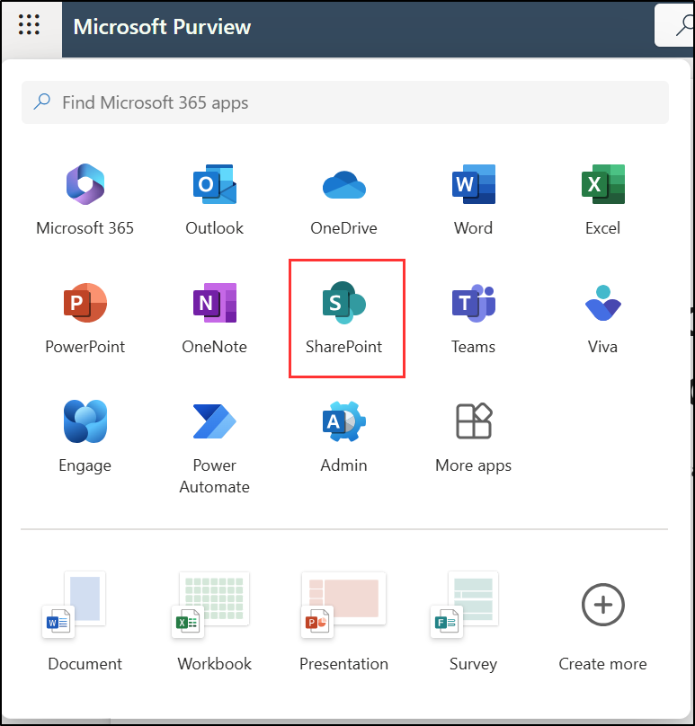

---
lab:
  title: 'Ejercicio 1: Configuración directivas de retención'
  module: Module 5 - Implement and manage retention
---

## Inquilinos de WWL: términos de uso

Si se te proporciona un inquilino porque estás realizando un curso dirigido por un instructor, ten en cuenta que ese inquilino está disponible únicamente como apoyo para los laboratorios prácticos del curso.

Los inquilinos no deben compartirse ni usarse para otros fines que no sean los de los laboratorios prácticos. El inquilino usado en este curso es un inquilino de prueba y no se puede usar ni tener acceso a él después de que la clase haya terminado y no es apto para la extensión.

Los inquilinos no se deben convertir a suscripciones de pago. Los inquilinos obtenidos como parte de este curso siguen siendo propiedad de Microsoft Corporation y nos reservamos el derecho de acceso y recuperación en cualquier momento.

# Laboratorio 5. Ejercicio 1: Implementación y administración de la retención

Eres Joni Sherman, administrador de cumplimiento en Contoso Ltd. La empresa está intensificando la estrategia de seguridad de datos para reducir la exposición a riesgos relacionados con los datos financieros y las comunicaciones privilegiadas. Se te ha pedido que configures las soluciones de retención de Microsoft Purview que admitan la preparación para auditorías, limiten la retención de datos innecesaria y garanticen la supervisión adecuada de las comunicaciones confidenciales.

**Tareas:**

1. Crear una etiqueta de retención.
1. Publicar una etiqueta de retención.
1. Crear una directiva de etiqueta de retención con aplicación automática.
1. Crear una directiva de retención estática.
1. Recuperar el contenido de SharePoint.

## Tarea 1: Creación de una etiqueta de retención

En esta tarea, crearás una etiqueta de retención para los datos financieros confidenciales que deben conservarse con fines de auditoría e investigación.

1. Inicia sesión en la VM Cliente 1 (SC-401-CL1) como la cuenta **SC-401-cl1\admin** .

1. En Microsoft Edge, ve a `https://purview.microsoft.com` e inicia sesión en Microsoft Purview portal como **Joni Sherman**`JoniS@WWLxZZZZZZ.onmicrosoft.com` (donde ZZZZZZ es tu identificador de inquilino único proporcionado por el proveedor de hospedaje del laboratorio). La contraseña de Joni se estableció en un ejercicio anterior.

1. Ve a **Soluciones** > **Administración del ciclo de vida de datos** > **Etiquetas de retención**.

1. En la página **Etiquetas**, selecciona **Crear una etiqueta**.

1. En la página **Nombre de la etiqueta de retención**, escribe:

   - **Nombre**: `Sensitive Financial Records`
   - **Descripción para los usuarios**: `Use for financial files with sensitive data that must be retained for audit or security purposes.`
   - **Descripción para los administradores**: `Retains high-impact financial data for 5 years to support audits and security investigations.`

1. Seleccione **Siguiente**.

1. En la página **Definir configuración de etiqueta**, elige **Conservar elementos para siempre o durante un período específico** y, a continuación, selecciona **Siguiente**.

1. En la página **Definir el período**, asegúrate de que estos valores se establecen para la entrada de configuración del período de retención:

    - **¿Cuánto tiempo dura el período?**: 5 años
    - **¿Cuándo debe comenzar el período?**: Cuando se modifican los elementos.

1. Seleccione **Siguiente**.

1. En la página **Elegir lo que sucede después del periodo de retención**, selecciona **Eliminar elementos automáticamente** y, a continuación, selecciona **Siguiente**.

1. En la **página Revisar y finalizar**, selecciona **Crear etiqueta**.

1. En la página **Se creó la etiqueta de retención**, selecciona la opción **No hacer nada** y, a continuación, selecciona **Listo**.

Has creado una etiqueta de retención que conserva el contenido financiero durante cinco años y lo elimina después para reducir la exposición de los datos.

## Tarea 2: Publicación de una etiqueta de retención

En esta tarea, publicarás la etiqueta de retención para que los usuarios puedan aplicarla en servicios de Microsoft 365 como Exchange, SharePoint y OneDrive.

1. En Microsoft Purview, ve a **Soluciones** > **Administración del ciclo de vida de datos** > **Etiquetas de retención**.

1. Activa la casilla situada junto a la etiqueta **Registros financieros confidenciales** y, a continuación, selecciona el icono **Publicar etiquetas** () para publicar esta etiqueta de retención.

1. En la página **Elegir etiquetas para publicar**, comprueba que está seleccionada la etiqueta **Registros financieros confidenciales** y, a continuación, selecciona **Siguiente**.

1. En la página **Ámbito de directiva**, selecciona **Siguiente**.

1. En la página **Elegir el tipo de directiva de retención que se va a crear**, selecciona **Estático** y, después, selecciona **Siguiente**.

1. En la página **Elegir dónde publicar etiquetas**, selecciona **Permitirme elegir ubicaciones específicas** y selecciona:

    - Buzones de Exchange
    - Sitios de SharePoint de comunicación y clásicos
    - Cuentas de OneDrive
    - Anule la selección de todas las demás ubicaciones

1. Seleccione **Siguiente**.

1. En **Nombre de la directiva** escribe:

    - **Nombre**: `Sensitive Financial Data Retention`
    - **Descripción**: `Makes the 'Sensitive Financial Records' label available to users in Exchange, SharePoint, and OneDrive.`

1. Seleccione **Siguiente**.

1. En la página **Finalizar**, selecciona **Enviar**.  

1. En la página **La etiqueta de retención se publicó**, selecciona **Listo**.

Has publicado la etiqueta de retención, lo que hará que esté disponible para que los usuarios la apliquen en los servicios clave de Microsoft 365.

## Tarea 3: Creación de una etiqueta de retención de aplicación automática.

En esta tarea, configurarás una directiva que aplica automáticamente una etiqueta de retención al contenido que contiene información financiera personal.

1. En Microsoft Purview, ve a **Soluciones ** > **Administración del ciclo de vida de datos** > **Directivas** > **Directivas de etiquetas**.

1. En la página **Directivas de etiquetas**, selecciona **Aplicar automáticamente una etiqueta** para iniciar la configuración de etiqueta.

1. En la **Página Introducción**, escribe:

   - **Nombre**: `Auto-apply Personal Financial PII`
   - **Descripción**: `Applies this label to personal financial data to help meet audit and investigation requirements. Retains content for 3 years.`

1. Seleccione **Siguiente**.

1. En la página **Elegir el tipo de contenido al que deseas aplicar esta etiqueta**, selecciona **Aplicar etiqueta al contenido que contiene información confidencial** y, después, selecciona **Siguiente**.

1. En la página **Contenido que incluye información confidencial**, selecciona la categoría **Financiero** y, a continuación, selecciona la regulación **Gramm-Leach-Bliley Act (GLBA) de EE. UU.** y, después, selecciona **Siguiente**.

1. En la página **Definir contenido que contiene información confidencial**, selecciona **Siguiente**.

1. En la página **Ámbito de directiva**, selecciona **Siguiente**.

1. En la página **Elegir el tipo de directiva de retención que se va a crear**, selecciona **Estático**.

1. En la página **Elegir dónde publicar etiquetas**, selecciona **Permitirme elegir ubicaciones específicas** y selecciona:

    - Buzones de Exchange
    - Sitios de SharePoint de comunicación y clásicos
    - Cuentas de OneDrive
    - Anule la selección de todas las demás ubicaciones

1. En la página **Elegir una etiqueta para aplicar automáticamente**, selecciona **Agregar etiqueta**.

1. En el control flotante **Elegir una etiqueta**, selecciona **Personal Financial PII** y, después, selecciona **Agregar**.

1. De nuevo en **Elegir una etiqueta para aplicar automáticamente**, selecciona **Siguiente**.

1. En **Decidir si se va a probar o ejecutar la directiva**, selecciona **Probar la directiva antes de ejecutarla** y, después, selecciona **Siguiente**.

1. En la página **Revisar y finalizar**, selecciona **Enviar** y, después, selecciona **Listo** en la página **La directiva de etiquetado automático se ha creado**.

Has creado una directiva de aplicación automática que identifica los datos financieros personales y aplica automáticamente una etiqueta de retención.

## Tarea 4: Creación de una directiva de retención estática

En esta tarea, crearás una directiva de retención estática para el contenido de Microsoft Teams para ayudar a reducir el riesgo de datos a largo plazo.

1. En Microsoft Purview, ve a **Soluciones** > **Administración del ciclo de vida de datos** > **Directivas** > **Directivas de retención**.

1. En la página **Directivas de retención**, selecciona **Nueva directiva de retención**.

1. En la **página Nombre a la directiva de retención**, escribe:

   - **Nombre**: `Teams Retention`
   - **Descripción**: `Retains Teams chats and channel messages for 3 years, then deletes them to reduce long-term data risk.`

1. Selecciona **Siguiente**.

1. En la página **Ámbito de directiva**, selecciona **Siguiente**.

1. En la página **Elegir el tipo de directiva de retención que se va a crear**, selecciona **Estático** y, después, selecciona **Siguiente**.

1. En la página **Elegir ubicaciones para aplicar la directiva**, habilita lo siguiente:

   - Mensajes de canales de Teams
   - Chats de Teams
   - Deja todas las demás ubicaciones deshabilitadas.

1. Seleccione **Siguiente**.

1. En la página **Decidir si deseas conservar el contenido, eliminarlo o ambos**, asegúrate de que estos valores se establecen para la configuración de retención:

   - Selecciona **Retener los elementos durante un período específico**.
   - En **Conservar elementos durante un período específico**, selecciona **Personalizado** en la lista desplegable.
   - Cambia el campo años a `3`.
   - **Iniciar el período de retención en función de**: cuándo se modificaron los elementos por última vez
   - **Al final del período de retención**: elimina los elementos automáticamente

1. Seleccione **Siguiente**.

1. En la página **Revisar y finalizar**, selecciona **Enviar** y luego selecciona **Listo** en la página **Has creado correctamente una directiva de retención**.

Has configurado una directiva de retención estática que conserva los mensajes de Teams durante tres años antes de eliminarlos automáticamente.

<!------ Commenting out until tenant bug issues are resolved
## Task 5 – Create an adaptive scope

In this task, you'll define an adaptive scope that targets Microsoft 365 groups associated with leadership and operations roles.

1. In Microsoft Purview, **Settings** > **Roles and scopes** > **Adaptive scopes**.

1. On the **Adaptive scopes** page select **+ Create scope**.

1. On the **Name your adaptive policy scope** page enter:

    - **Name**: `Leadership and Ops Groups`
    - **Description**: `Targets Leadership and Operations M365 groups with privileged access to sensitive data.`

1. Select **Next**.

1. On the **Assign admin unit** page select **Next**.

1. On the **What type of scope do you want to create?** page select **Users**, then select **Next**.

1. On the **Create the query to define users** page, in the **User attributes** section, ensure these values are selected for the user attribute configuration:

   - Select the **Attribute** dropdown then select **Department**
   - Leave the default **is equal to** value in the next field
   - Enter `Leadership` as the **Value**

1. Add a second attribute by selecting **+ Add attribute** on the **Create the query to define users** page. In the new field under the one we just configured, configure these values:

   - Select the dropdown for the query operator and update it from And to **Or**
   - Select the **Attribute** dropdown then select **Department**
   - Leave the default **is equal to** value in the next field
   - Enter `Operations` as the **Value**

1. Select **Next**.

1. On the **Review and finish** page select **Submit**.

1. Once your adaptive scope is created select **Done** on the **Your scope was created** page.

You've created an adaptive scope to support targeted retention for privileged groups in the organization.

## Task 6 – Create an adaptive retention policy

In this task, you'll use the adaptive scope you created to configure a retention policy for Microsoft 365 groups with sensitive responsibilities.

1. In Microsoft Purview, navigate to **Solutions** > **Data Lifecycle Management** > **Policies** >  **Retention policies**.

1. On the **Retention policies** page, select **+ New retention policy**.

1. On the **Name your retention policy** page enter:

    - **Name**: `Privileged Group Retention`
    - **Description**: `Retains content from Leadership and Operations groups for 5 years to support audit and investigation.`

1. Select **Next**.

1. On the **Policy Scope** page select **Next**.

1. On the **Choose the type of retention policy to create** page select **Adaptive** then select **Next**.

1. On the **Choose adaptive policy scopes and locations** page select **+ Add scopes**.

1. On the **Choose adaptive policy scopes** flyout panel select the checkbox for **Leadership and Ops Groups** then select **Add** at the bottom of the panel.

1. Back on the **Choose locations to apply the policy** enable:

    - Microsoft 365 Group mailboxes & sites
    - Leave all other locations disabled.

1. Select **Next**.

1. On the **Decide if you want to retain content, delete it, or both** page, ensure these values are set for the retention configuration:

   - Select **Retain items for a specific period**.
   - Under **Retain items for a specific period**, select **5 years** from the dropdown list
   - **Start the retention period based on**: When items were last modified
   - **At the end of the retention period**: Delete items automatically

1. Select **Next**.

1. On the **Review and finish** page select **Submit**.

1. Select **Done** once the policy is created.

You've created a retention policy that applies to content owned by privileged groups, retaining it for five years before deletion.
-->

## Tarea 5: Recuperar contenido de SharePoint

En esta tarea, simularás la restauración de un documento eliminado de un sitio de SharePoint para validar las opciones de recuperación.

1. Todavía deberías estar conectado en la máquina virtual Client 1 (SC-401-CL1) con la cuenta **SC-401-CL1\admin** y haber iniciado sesión como Joni Sherman en Microsoft Purview.

1. Selecciona el iniciador de aplicaciones (el icono de cuadrícula) en la esquina superior izquierda y, luego, selecciona **SharePoint** en el submenú.

   

1. En la página de aterrizaje de SharePoint, busca `Benefits` y selecciona **Ventajas @ Contoso** en los resultados de búsqueda.

1. En la barra lateral izquierda, selecciona **Documentos**.

1. En la página **Documentos**, activa la casilla **Vacation Policies.pptx** selecciona **Eliminar** en la barra de acciones.

1. En el cuadro de diálogo **¿Eliminar?**, selecciona **Eliminar**.

1. Selecciona **Papelera de reciclaje** en la barra lateral izquierda.

1. En la página **Papelera de reciclaje**, haz clic con el botón derecho en **Vacation Policies.pptx** y, después, selecciona **Restaurar**.

1. En la barra lateral izquierda, selecciona **Documentos** y observa que se ha restaurado el archivo.

Has recuperado correctamente un documento eliminado de un sitio de SharePoint.
