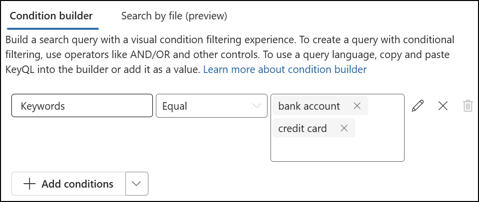

---
lab:
  title: 'Ejercicio 2: Realización de una búsqueda de contenido'
  module: Module 6 - Audit and search activity in Microsoft Purview
---

## Inquilinos de WWL: términos de uso

Si se te proporciona un inquilino porque estás realizando un curso dirigido por un instructor, ten en cuenta que ese inquilino está disponible únicamente como apoyo para los laboratorios prácticos del curso.

Los inquilinos no deben compartirse ni usarse para otros fines que no sean los de los laboratorios prácticos. El inquilino usado en este curso es un inquilino de prueba y no se puede usar ni tener acceso a él después de que la clase haya terminado y no es apto para la extensión.

Los inquilinos no se deben convertir a suscripciones de pago. Los inquilinos obtenidos como parte de este curso siguen siendo propiedad de Microsoft Corporation y nos reservamos el derecho de acceso y recuperación en cualquier momento.

# Laboratorio 6: Ejercicio 2: Realización de una búsqueda de contenido

Eres Joni Sherman, administradora de seguridad de la información en Contoso Ltd. La organización ha recibido una alerta de que es posible que se hayan expuesto datos financieros confidenciales. Se te ha pedido que uses Microsoft Purview para buscar contenido que contenga términos financieros clave en los servicios de Microsoft 365. Tu objetivo es determinar si algún contenido confidencial se ha compartido de forma inapropiada y apoyar la investigación.

**Tareas:**

1. Asignar permisos de eDiscovery
1. Búsqueda de contenido con términos financieros confidenciales

## Tarea 1: Asignación de permisos de eDiscovery

En esta tarea, asignarás permisos de eDiscovery a Joni Sherman para que pueda realizar una búsqueda de contenido en Microsoft Purview.

1. Inicia sesión en la máquina virtual Client 1 (SC-401-CL1) como la cuenta **SC-401-CL1\admin**.

1. Si has iniciado sesión como Joni, cierra la sesión y cierra todas las ventanas del explorador.

1. Abre **Microsoft Edge**, ve a **`https://purview.microsoft.com`** e inicia sesión en Microsoft Purview portal como **Administrador MOD**`admin@WWLxZZZZZZ.onmicrosoft.com` (donde ZZZZZZ es tu identificador de inquilino único proporcionado por el proveedor de hospedaje del laboratorio). La contraseña de administrador te la debería haber proporcionado tu proveedor de servicios de hospedaje de laboratorio.

1. En la barra lateral izquierda, selecciona **Configuración** > **Roles y ámbitos** > **Grupos de roles**.

1. En la página **Grupos de roles para soluciones de Microsoft Purview**, busca `eDiscovery` y, a continuación, selecciona **Administrador de eDiscovery**.

1. En la página flotante **Administrador de eDiscovery**, selecciona **Editar**.

1. En la página **Administrar Administrador de eDiscovery**, selecciona **Elegir usuarios**.

1. En la página flotante **Elegir usuarios**, busca `Joni` y, a continuación, activa la casilla **Joni Sherman**. Selecciona el botón **Seleccionar** en la parte inferior del panel.

1. De nuevo en la página **Administrar administrador de eDiscovery**, selecciona **Siguiente**.

1. En la página **Administrar Administrador de eDiscovery**, selecciona **Siguiente**.

1. En la página **Revisar el grupo de roles y finalizar**, selecciona **Guardar**.

1. En la página **Has actualizado correctamente el grupo de roles**, selecciona **Listo**.

1. Cierra la sesión de la cuenta de administrador MOD mediante la selección del icono **MA** en la parte superior derecha de la ventana y, a continuación, selecciona **Cerrar sesión**.

Has asignado permisos de eDiscovery a Joni Sherman, lo que te permite buscar contenido confidencial como parte de la investigación.

## Tarea 2: Búsqueda de contenido con términos financieros confidenciales

1. En Microsoft Edge, ve a `https://purview.microsoft.com` e inicia sesión en Microsoft Purview portal como **Joni Sherman**`JoniS@WWLxZZZZZZ.onmicrosoft.com` (donde ZZZZZZ es tu identificador de inquilino único proporcionado por el proveedor de hospedaje del laboratorio). La contraseña de Joni se estableció en un ejercicio anterior.

1. En Microsoft Purview, ve a **Soluciones** > **eDiscovery**.

1. En la página **Casos**, selecciona la lista desplegable situada junto a **Crear caso** y, a continuación, selecciona **Crear búsqueda**.

   

1. En el cuadro de diálogo **Escribir detalles para empezar**, escribe:

   - **Nombre del caso**: `Financial Data Exposure Review`
   - **Nombre de búsqueda**: `Financial Data Leak Investigation`
   - **Descripción del caso**: `Case opened to support security investigation efforts by identifying potential exposure of sensitive financial terms in Microsoft 365 content.`
   - **Descripción de la búsqueda**: `Search targets common high-risk financial keywords to support data security monitoring and policy validation.`

1. Selecciona **Crear** para crear la búsqueda.

1. En la página **Investigación de fugas de datos financieros**, en **Orígenes de datos**, selecciona **+** (signo más) > **Agregar orígenes de datos**.

   

1. En el control flotante **Buscar orígenes**, selecciona el grupo **Equipo financiero** y, a continuación, selecciona **Guardar y cerrar**.

1. En el panel **Generador de condiciones**, agrega las palabras clave `bank account` y `credit card`, a continuación, selecciona **Ejecutar consulta**.

   

1. En el control flotante **Elegir resultados de búsqueda** en **Estadísticas**, activa las casillas para **Incluir categorías** e **Incluir informe de palabras clave de consulta** y, a continuación, selecciona **Ejecutar consulta**.

1. Revisa los resultados de la búsqueda:

   - Selecciona la pestaña **Estadísticas** para ver un resumen de las métricas de búsqueda.
   - Selecciona la pestaña **Muestra** para obtener una vista previa del contenido coincidente.

Has realizado una búsqueda de contenido basada en palabras clave para ayudar a identificar si se han compartido datos financieros confidenciales de forma inapropiada. Estos resultados respaldan las investigaciones de seguridad y ayudan a guiar la respuesta al riesgo.
