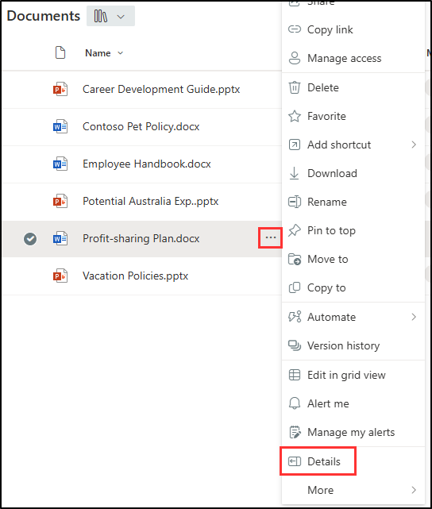

---
lab:
  title: 'Validación de directivas de confidencialidad, DLP y retención'
  module: 'Policy validation - Validate sensitivity, DLP, and retention policies'
---

## Inquilinos de WWL: términos de uso

Si se te proporciona un inquilino porque estás realizando un curso dirigido por un instructor, ten en cuenta que ese inquilino está disponible únicamente como apoyo para los laboratorios prácticos del curso.

Los inquilinos no deben compartirse ni usarse para otros fines que no sean los de los laboratorios prácticos. El inquilino usado en este curso es un inquilino de prueba y no se puede usar ni tener acceso a él después de que la clase haya terminado y no es apto para la extensión.

Los inquilinos no se deben convertir a suscripciones de pago. Los inquilinos obtenidos como parte de este curso siguen siendo propiedad de Microsoft Corporation y nos reservamos el derecho de acceso y recuperación en cualquier momento.

# Laboratorio de validación: Validación de directivas de confidencialidad, DLP y retención

Eres Joni Sherman, administrador de seguridad de la información en Contoso Ltd. Ahora que has configurado etiquetas de confidencialidad, prevención de pérdida de datos (DLP) y directivas de retención, se te ha pedido que valides que esas configuraciones funcionen según lo previsto. En este laboratorio, probarás el comportamiento de cada directiva en las aplicaciones de Microsoft 365 y comprobarás que el contenido esté protegido y retenido según la configuración de la directiva.

**Tareas:**

1. Aplicar etiquetas de confidencialidad en Word
1. Desencadenar una directiva DLP en Outlook
1. Aplicar etiquetas de retención y confidencialidad en SharePoint

## Tarea 1: Aplicar una etiqueta de confidencialidad en Word

En esta tarea, comprobarás que las etiquetas de confidencialidad publicadas están disponibles para los usuarios y se pueden aplicar directamente desde Microsoft Word.

1. Todavía deberías tener la sesión iniciada en la VM Cliente 1 (SC-401-CL1) como la cuenta **SC-401-CL1\admin** y debes tener la sesión iniciada en Microsoft 365 como **Joni Sherman**`JoniS@WWLxZZZZZZ.onmicrosoft.com` (donde ZZZZZZ es tu id. de inquilino único proporcionado por el proveedor de hospedaje del laboratorio). La contraseña de Joni se estableció en un ejercicio anterior.

1. En Microsoft Edge, selecciona el iniciador de aplicaciones en la parte superior izquierda y elige **Word**.

    

1. Selecciona **Documento en blanco**.

1. Si se te solicita, cierra el cuadro de diálogo **Opciones de privacidad**.

1. Escribe el texto a continuación en el documento:

   `Important HR employee document.`

1. Selecciona **Confidencialidad** en la cinta de navegación y selecciona **Interno** > **Datos de empleados (HH. RR.)** para aplicar la etiqueta de confidencialidad recién creada a este documento.

    

    > [!Note] Las etiquetas de confidencialidad recién publicadas pueden tardar entre 24 y 48 horas en estar disponibles para la aplicación. Si las etiquetas de confidencialidad recién creadas no están disponibles, puedes usar **Confidencial** > **Todos los empleados** para este ejercicio.

1. Cambia la etiqueta de confidencialidad a **Público** para comprobar que aparece el cuadro de diálogo de justificación comercial.

1. Selecciona **Cancelar** para mantener la etiqueta de confidencialidad.

1. En la parte superior izquierda del documento, selecciona **Documento** para cambiar el nombre de este archivo y cambiarle el nombre a **`HR Document`**. Presiona Entrar para aplicar este cambio de nombre.

    

Has comprobado que la etiqueta de confidencialidad de RR. HH. está disponible y aplica las protecciones adecuadas a un documento de Word.

## Tarea 2: Desencadenar una directiva DLP en Outlook

A continuación, enviarás información confidencial de los empleados en un correo electrónico para comprobar que la directiva DLP detecta y bloquea correctamente la actividad.

1. Todavía deberías tener la sesión iniciada en la VM Cliente 1 (SC-401-CL1) como la cuenta **SC-401-CL1\admin** e tener la sesión iniciada en Microsoft 365 como Joni Sherman.

1. En Microsoft Edge, selecciona el iniciador de aplicaciones en la parte superior izquierda y elige **Outlook**.

1. Selecciona el botón **Correo nuevo** en la parte superior izquierda para redactar un nuevo mensaje de correo electrónico.

1. En el campo **Para**, escribe `Megan` y selecciona la dirección de correo electrónico de **Megan Bowen**.

1. En el campo Asunto, escribe `Help with employee information`.

1. Escribe en el cuerpo del correo electrónico:

   ``` text
   Please help me with the start dates for the following employees:
   ABC123456
   DEF678901
   GHI234567

   Thank you, 
   Joni Sherman
   ```

1. Selecciona el botón **Enviar** en la esquina superior derecha de la ventana del mensaje para enviar el correo electrónico.

1. Debes recibir un mensaje que indica que el correo no era apto para la entrega y está bloqueado por una directiva DLP.

   

Has confirmado que la directiva DLP bloqueó la transmisión de id. de empleados confidenciales por correo electrónico.

## Tarea 3: Aplicar etiquetas de retención y confidencialidad en SharePoint

Para probar la configuración de retención, aplicarás una etiqueta de retención a un documento almacenado en SharePoint y comprobarás que las etiquetas de confidencialidad también están disponibles.

1. Todavía deberías tener la sesión iniciada en la VM Cliente 1 (SC-401-CL1) como la cuenta **SC-401-CL1\admin** e tener la sesión iniciada en Microsoft 365 como Joni Sherman.

1. En Microsoft Edge, selecciona el iniciador de aplicaciones en la parte superior izquierda y elige **SharePoint**.

1. En la página de aterrizaje de SharePoint, busca `Benefits` y selecciona **Ventajas @ Contoso** en los resultados de búsqueda.

1. Selecciona **Documentos** en el panel izquierdo.

1. En la página **Documentos**, selecciona los puntos suspensivos situados junto a **Profit-sharing Plan.docx** y, después, selecciona **Detalles**.

   

1. En el panel **Detalles**, actualiza los siguientes campos:
   - **Confidencialidad**: Confidencial - Finanzas
   - **Aplicar etiqueta**: Registros financieros confidenciales

     

Has confirmado que las etiquetas de retención y confidencialidad están disponibles y que se pueden aplicar a documentos de SharePoint.
